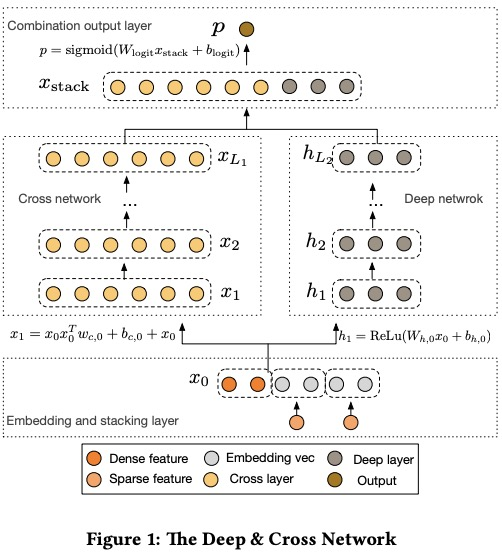
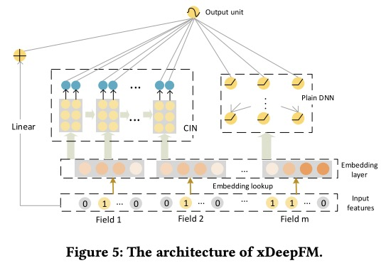

# ExplicitHighOrderInteraction-Keras

这个代码仓库使用 **Keras** 框架实现了多种引入**显式高阶交叉**的**推荐系统模型**，其中包含的模型有：**DCN**, **xDeepFM**, **AutoInt** 等等。除了模型实现，还附带了简化的应用程序。

## 向导

1. [环境](#环境)
2. [使用说明](#使用说明)
3. [模型](#模型)
    1. [DCN](#1-dcn)
    2. [xDeepFM](#2-xdeepfm)
    3. [AutoInt](#3-autoint)
    999. [未完待续……](#未完待续)
4. [引用](#引用)

## 环境

- Python 3.7
- NumPy 1.17.2
- Tensorflow 2.0.0

## 使用说明

代码部分都位于目录 `/model` 下，每种模型有相应的目录，该目录下放置了模型代码和应用代码。

例如：DCN 的模型代码和应用代码都位于 `/model/DCN` 下，模型部分是 `dcn.py` 和 `cross_network.py`，应用部分是 `main.py`。

## 模型

### 1 DCN

	

上图展示了 DCN 的模型框架，由下至上分别是：输入层，Deep Network（右半部分）与 Cross Network（左半部分），输出层。

1. **输入层**。输入特征主要包含连续型特征（Dense Feature）和离散型特征（Sparse Feature），离散型特征通过 Embedding 层嵌入成向量，并与连续型特征拼接输送给后续模块。
2. **Deep Network 模块与 Cross Network 模块**。这两个模块的作用是将输入层传来的向量进行隐式交叉和显式交叉，其中 Cross Network 模块能够对特征进行显式的高阶交叉，进而学习数据中蕴含的重要信息，并将信息表征成向量输送给最后的输出层。
3. **输出层**。该层接收表征向量，矩阵变换后，通过 Sigmoid 函数进行缩放，得到最终的输出值。

本项目使用 Keras 框架实现了以下的模块和模型：

1. 基于 `tf.keras.layers.Layer` 类的 [`CrossNetwork`](https://github.com/ShawnyXiao/HighOrderInteraction-Keras/blob/master/model/DCN/cross_network.py) 模块
2. 基于 `tf.keras.Model` 类的 [`DCN`](https://github.com/ShawnyXiao/HighOrderInteraction-Keras/blob/master/model/DCN/dcn.py) 模型

### 2 xDeepFM

	

上图展示了 xDeepFM 的模型框架，由下至上分别是：输入层，Linear 模块（左边部分）、CIN 模块（中间部分）与 Plain DNN 模块（右边部分），输出层。

1. **输入层**。输入特征主要包含离散型特征（Sparse Feature）和多值离散型特征（Multi-hot Sparse Feature），这两种特征分别通过 Embedding 层嵌入成向量，并输送给后续模块。
2. **Linear 模块、CIN 模块与 Plain DNN 模块**。这三个模块的作用是将输入层传来的向量进行隐式交叉和显式交叉，其中 CIN 模块能够以向量粒度进行特征之间的显式高阶交叉，支持 vector-wise 的显式高阶交叉，学习特征之间的相关性，最终表征成向量输送给最后的输出层。
3. **输出层**。该层接收表征向量，矩阵变换后，通过 Sigmoid 函数进行缩放，得到最终的输出值。

本项目使用 Keras 框架实现了以下的模块和模型：

1. 基于 `tf.keras.layers.Layer` 类的 [`CIN`](https://github.com/ShawnyXiao/HighOrderInteraction-Keras/blob/master/model/xDeepFM/cin.py) 模块
2. 基于 `tf.keras.Model` 类的 [`xDeepFM`](https://github.com/ShawnyXiao/HighOrderInteraction-Keras/blob/master/model/xDeepFM/xdeepfm.py) 模型

### 3 AutoInt

### 未完待续……

## 参考文献

1. [Deep & Cross Network for Ad Click Predictions](https://arxiv.org/pdf/1708.05123.pdf)
2. [xDeepFM: Combining Explicit and Implicit Feature Interactions for Recommender Systems](https://arxiv.org/pdf/1803.05170.pdf)
3. [AutoInt: Automatic Feature Interaction Learning via Self-Attentive Neural Networks](https://arxiv.org/pdf/1810.11921.pdf)